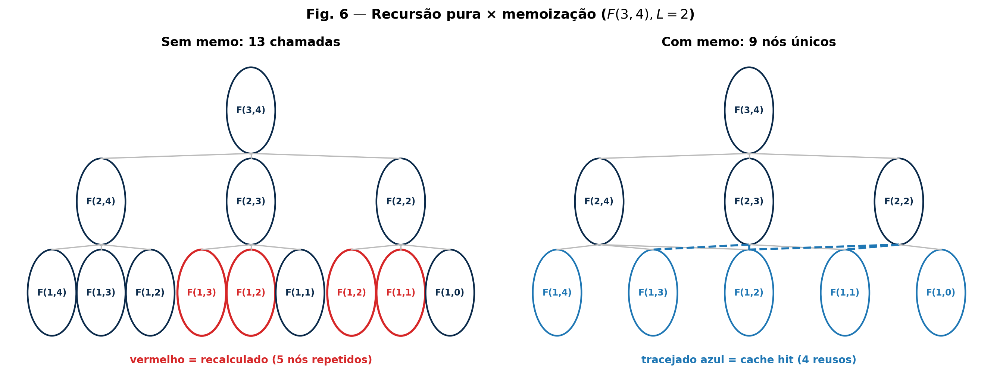
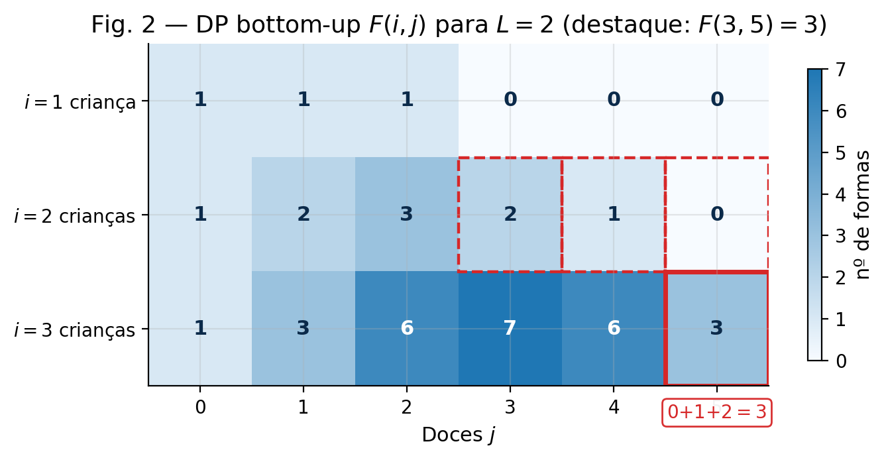
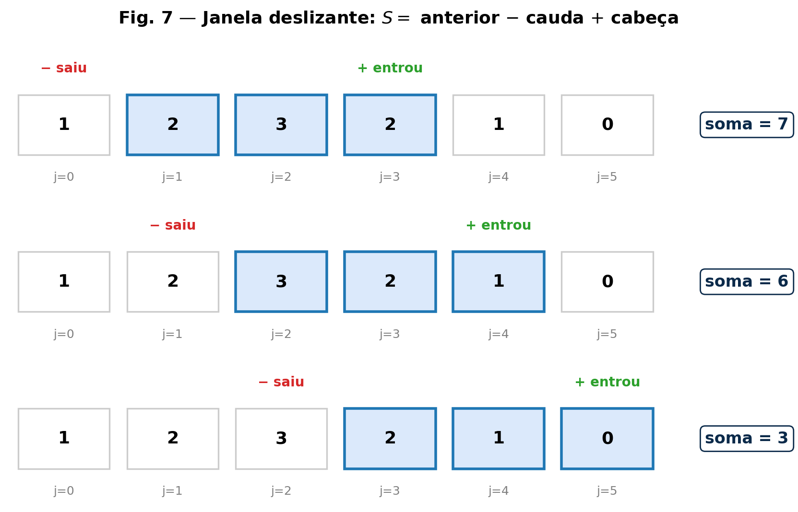
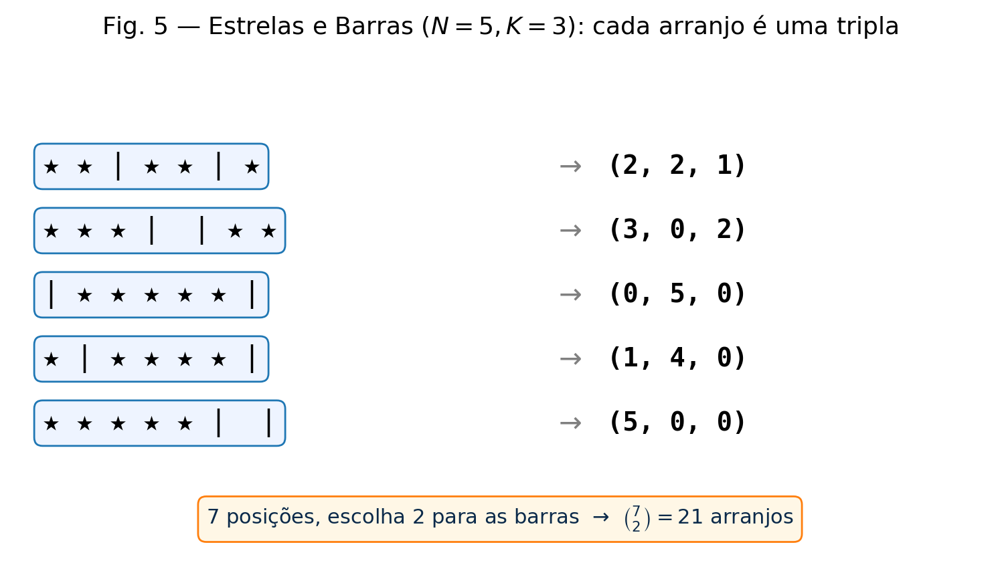
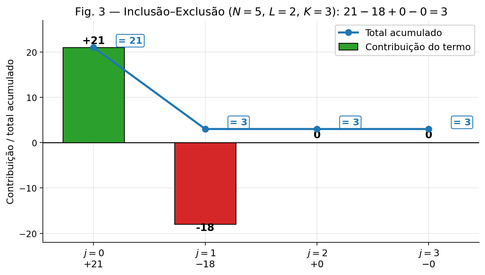
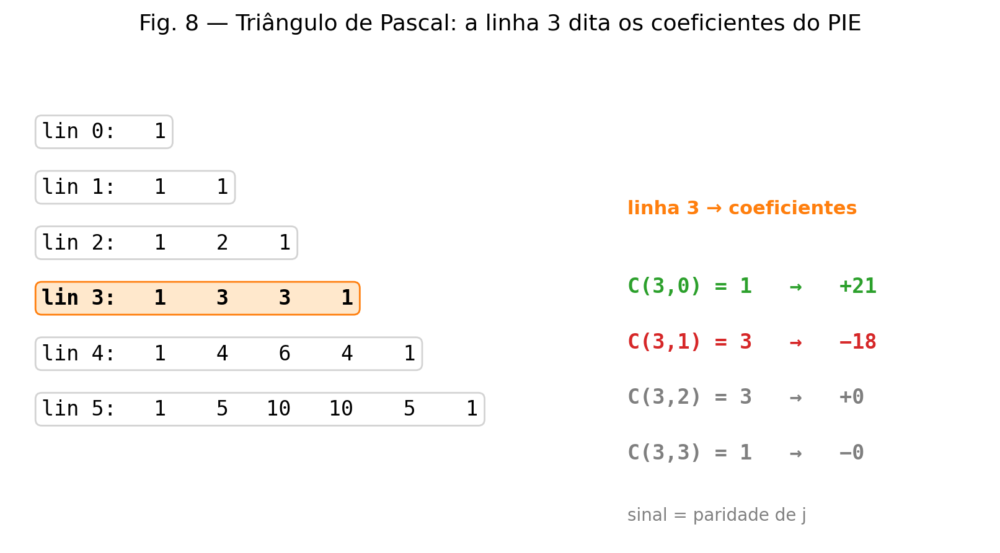
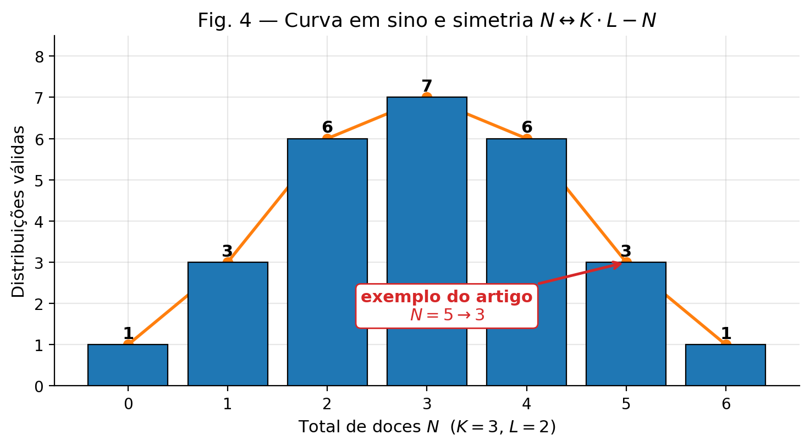
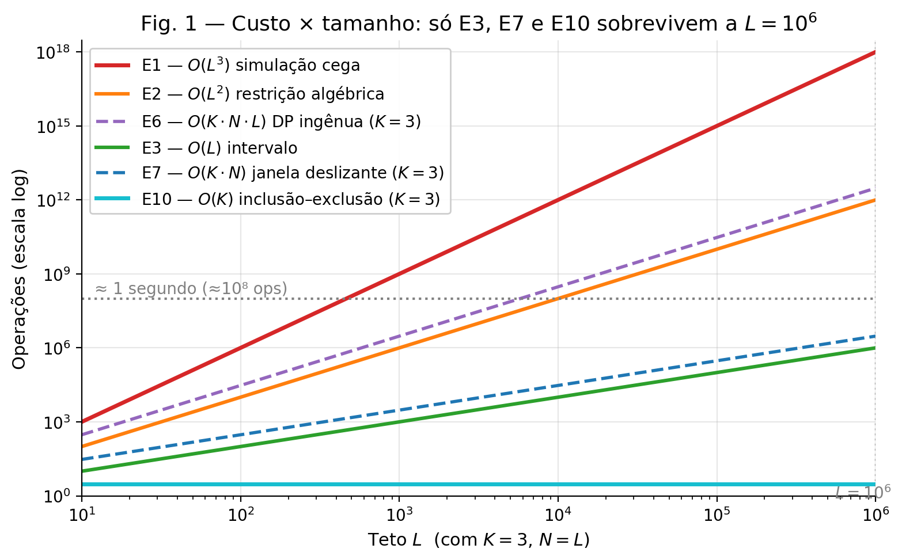

# Distribuindo Doces: Uma Jornada em Dez Estágios da Otimização Algorítmica

## O Problema

Cinco doces idênticos, três crianças. Cada criança pode receber no máximo $2$ doces. Quantas distribuições existem?

Listando à mão: $(1,2,2)$, $(2,1,2)$, $(2,2,1)$. Três.

Como os doces são **idênticos**, uma distribuição fica completamente descrita por *quantos* doces cada criança recebe. Não importa qual doce específico foi para qual criança — apenas a quantidade. Cada distribuição corresponde, portanto, a uma tripla de inteiros $(x_1, x_2, x_3)$ satisfazendo simultaneamente:

$$
x_1 + x_2 + x_3 = N
$$

$$
0 \le x_1 \le L, \quad 0 \le x_2 \le L, \quad 0 \le x_3 \le L
$$

Para $N = 5$ e $L = 2$, as três triplas acima são as únicas válidas.

Agora imagine $N = 10^6$ e $L = 10^6$. Listar está fora de questão. Precisamos **contar** — e contar sem enumerar.

Este artigo percorre **dez estágios** de evolução, cada um curado por uma dor concreta do anterior. Atravessamos três eras: a **Força Bruta**, a **Otimização Algorítmica** e a **Transcendência Matemática**. O exemplo $N=5, L=2$ nos acompanha até o fim, servindo de âncora concreta para todas as abstrações. Ao final, generalizamos a solução para qualquer número $K$ de crianças e discutimos como o mundo real lida com números que não cabem em memória.

---

## FASE I — O Instinto: Testando o Mundo

### Evolução 1 — A Simulação Cega (3 dimensões)

O instinto mais honesto: percorrer todas as combinações possíveis de $(x_1, x_2, x_3)$ e contar as que somam $N$.

A estrutura é simples: três laços aninhados, cada um de $0$ a $L$, e uma verificação de soma. A contagem geral é o número de triplas com $x_i \in [0, L]$ que satisfazem a igualdade.

**A Matemática.**

$$
\text{Total} = \sum_{x_1=0}^{L} \sum_{x_2=0}^{L} \sum_{x_3=0}^{L} \mathbb{1}[x_1 + x_2 + x_3 = N]
$$

Para $N = 5, L = 2$, o laço percorre $3^3 = 27$ triplas e conta 3 que satisfazem.

> **Onde dói.** Complexidade $\mathcal{O}(L^3)$. Para $L = 10^6$, são $10^{18}$ verificações. O computador faria trilhões de testes inúteis — como testar $(0, 0, 0)$ sabendo que $N$ é enorme.
>
> *A pergunta que fica: se a soma tem que ser exatamente $N$, por que estou testando valores que claramente vão estourar ou faltar?*

### Evolução 2 — A Restrição Algébrica (2 dimensões)

A primeira percepção útil: **a terceira variável não é independente.** Se eu já decidi $x_1 = a$ e $x_2 = b$, então $x_3 = N - a - b$ está determinado. Não há escolha.

Reduzo o espaço de busca a dois laços sobre $a$ e $b$, e passo a verificar se o $c$ resultante cai no intervalo válido.

**A Matemática.**

$$
\text{Total} = \sum_{a=0}^{L} \sum_{b=0}^{L} \mathbb{1}\big[\,0 \le N - a - b \le L\,\big]
$$

Para $N = 5, L = 2$, o laço percorre $3^2 = 9$ pares e conta 3 válidos.

> **Onde dói.** Complexidade $\mathcal{O}(L^2)$. Para $L = 10^5$, são $10^{10}$ pares. Ainda inviável. E o desperdício não é só o tamanho: para cada par $(a, b)$ recomeçamos do zero, ignorando que as crianças formam uma estrutura.
>
> *A pergunta que fica: para um valor fixo de $a$, o quanto $b$ pode variar é definido por um intervalo algébrico. Por que estou testando $b$ valor por valor, em vez de contar o tamanho desse intervalo?*

### Evolução 3 — O Achatamento por Intervalo (1 dimensão)

A segunda percepção: **fixado $a$, o intervalo válido de $b$ é determinado.** Da condição $0 \le N - a - b \le L$, isolo $b$:

$$
b \in [\max(0, N - a - L), \min(L, N - a)]
$$

Se o intervalo for vazio, contribui com $0$. Caso contrário, contribui com o **tamanho** do intervalo, sem precisar testar elemento por elemento.

**A Matemática.**

$$
\text{Total} = \sum_{a=0}^{L} \text{tam}\Big([\max(0, N-a-L), \min(L, N-a)]\Big)
$$

Para $N = 5, L = 2$: o intervalo de $a$ válido é $[1, 2]$; para $a = 1$, $b$ está em $[2, 2]$ (1 valor); para $a = 2$, $b$ está em $[1, 2]$ (2 valores). Total: 3.

> **Onde dói.** Complexidade $\mathcal{O}(L)$. Para $L = 10^6$, são $10^6$ iterações — passa. Mas a solução é **frágil e hardcoded**: se o chefe pedir 5 crianças, precisaríamos deduzir manualmente equações de máximos e mínimos para quatro variáveis, e o laço único viraria três laços aninhados novamente.
>
> *A pergunta que fica: existe uma forma sistemática de resolver para qualquer número $K$ de crianças, sem refazer a álgebra a cada novo caso?*

---

## FASE II — A Sistematização Computacional: Programação Dinâmica

### Evolução 4 — A Árvore de Decisão (Recursão Pura)

Abandonamos a álgebra manual e criamos um sistema que **se auto-divide**: dividir para conquistar. A pergunta "de quantas formas distribuo $N$ doces entre $K$ crianças?" se decompõe em "dou $X$ doces à primeira criança, e pergunto de quantas formas distribuo $N - X$ doces entre $K - 1$ crianças".

Formalmente, definimos:

$$
F(i, j) = \text{número de formas de distribuir } j \text{ doces entre } i \text{ crianças com teto } L.
$$

**A Matemática (recursiva).**

$$
F(i, j) = \sum_{x=0}^{\min(L, j)} F(i-1, j-x), \qquad F(0, 0) = 1, \quad F(0, j>0) = 0
$$

Para $N = 5, L = 2$:

$$
F(3, 5) = F(2, 5) + F(2, 4) + F(2, 3) = \dots = 3
$$

> **Onde dói.** A recursão desenha uma **árvore exponencial**. Cada chamada abre até $L+1$ filhos. O mesmo estado $(i, j)$ é recalculado em caminhos diferentes. Complexidade: $\mathcal{O}((L+1)^K)$ — catastrófica. A árvore ramifica infinitamente, recalculando o mesmo cenário ("3 doces para 2 crianças") milhares de vezes por caminhos distintos.
>
> *A pergunta que fica: se estamos recalculando a mesma pergunta várias vezes, por que não anotar a resposta na primeira vez que a vimos?*

### Evolução 5 — A Memória (Recursão com Memoização)

Criamos um "caderno de anotações": uma tabela que mapeia cada par $(i, j)$ para o valor de $F(i, j)$ já calculado. Toda vez que a recursão tenta calcular algo, primeiro verifica se já está anotado. Se estiver, devolve direto.

**A Matemática.** A recursão é a mesma da Evolução 4. A diferença é que cada estado $(i, j)$ é computado uma única vez.

O número total de estados é $K \cdot N$, e cada estado gasta até $L + 1$ operações para ser computado. Complexidade: $\mathcal{O}(K \cdot N \cdot L)$.



*Figura 6 — A Fig. 6 mostra o problema e a solução lado a lado para $F(3, 4)$ com $L = 2$. Sem memo (Evolução 4), 13 chamadas com 5 nós recalculados em vermelho; com memo (Evolução 5), 9 nós únicos e 4 cache hits em tracejado azul.*

> **Onde dói.** Memória de execução. A recursão desce $K \cdot N$ níveis antes de retornar. Para $N = 10^6$ e $K = 10^6$, a pilha estoura — *stack overflow*. O processador simplesmente não tem espaço físico para tanta chamada aninhada.
>
> *A pergunta que fica: se a recursão (top-down) quebra a pilha, posso calcular na direção inversa — do menor problema para o maior — sem recursão?*

### Evolução 6 — A Construção de Base (DP Iterativa)

Em vez de calcular de cima para baixo (top-down), construímos de baixo para cima (bottom-up). Criamos uma matriz onde as linhas são o número de crianças e as colunas o número de doces. Preenchemos a linha de 1 criança, usamos ela para preencher a linha de 2, e assim por diante.

A transição é a mesma:

$$
F(i, j) = \sum_{x=0}^{\min(L, j)} F(i-1, j-x)
$$

Mas agora em ordem crescente de $i$ e $j$, sem recursão.

Para $N=5, L=2$:

- **Linha $i=1$:** $F(1, 0)=F(1,1)=F(1,2)=1$; $F(1, 3)=F(1,4)=F(1,5)=0$.
- **Linha $i=2$:** $F(2,0)=1$, $F(2,1)=2$, $F(2,2)=3$, $F(2,3)=2$, $F(2,4)=1$, $F(2,5)=0$.
- **Linha $i=3$:** $F(3,5) = F(2,5)+F(2,4)+F(2,3) = 0+1+2 = 3$.



*Figura 2 — A matriz da Evolução 6 para o caso-âncora. Cada célula é a soma de até $L+1=3$ células da linha de cima. O destaque vermelho mostra $F(3,5) = F(2,3)+F(2,4)+F(2,5) = 2+1+0 = 3$: a "janela" que a Evolução 7 vai aprender a deslizar em $\mathcal{O}(1)$.*

> **Onde dói.** Complexidade $\mathcal{O}(K \cdot N \cdot L)$. Para $K = N = L = 10^6$, são $10^{18}$ operações. O resultado é *Time Limit Exceeded*.
>
> Mas olhe com atenção o laço mais profundo — a transição. Para preencher uma célula da matriz, estamos somando uma "janela" exata de células da linha de cima. E quando avançamos para a próxima célula, a janela anda **uma casa para a direita**.
>
> *A pergunta que fica: estamos somando a mesma janela repetidamente. Não dá para reusar a soma anterior?*

### Evolução 7 — A Janela Deslizante (DP com Soma de Prefixos)

A ideia: em vez de somar a janela inteira a cada nova célula, pegamos a soma anterior, **subtraímos a cauda** que saiu da janela e **somamos a cabeça** que entrou. Uma operação aritmética substitui o loop interno.

**A Matemática (recorrência da janela).**

$$
S(i, j) = S(i, j-1) + F(i-1, j) - F(i-1, j - L - 1)
$$

onde $S(i, j) = F(i, j)$ é a soma da janela atual. O loop interno de $0$ a $L$ desaparece. Complexidade: $\mathcal{O}(K \cdot N)$.



*Figura 7 — A janela de tamanho $L+1 = 3$ anda uma casa sobre a linha $F(2, \cdot)$: $7 \to 6 \to 3$ apenas subtraindo a cauda que sai (vermelho) e somando a cabeça que entra (verde). É a recorrência da Evolução 7 em ação, produzindo $F(3,3)$, $F(3,4)$ e $F(3,5)$.*

> **Onde dói.** A matemática está quase no limite da Ciência da Computação. Mas para $K = 10^6$ e $N = 10^6$, a matriz precisaria de $10^{12}$ células. Seriam **terabytes de memória RAM** só para armazenar estados intermediários.
>
> *A pergunta que fica: a Programação Dinâmica exige que percorramos $N$ doces, um por um, materializando estados. Para nos libertar da dependência física de $N$, precisamos mudar de dimensão. Sair do processamento e ir para a geometria pura.*

---

## FASE III — A Transcendência Matemática: Combinatória

### Evolução 8 — O Sistema Global (O Universo sem Restrições)

Esqueça processar doces um a um. Pense nos $N$ doces alinhados na mesa. Coloque $K - 1$ divisórias (barras) entre eles. Espalhar essas barras distribui os doces para todo mundo simultaneamente.

Duas barras em $N + 2$ posições: $\binom{N + 2}{2}$. Esse é o **universo absoluto** de soluções não-negativas, sem teto.

**A Matemática (Estrelas e Barras).**

$$
\text{Sem teto} = \binom{N + K - 1}{K - 1}
$$

Para $N = 5, K = 3$: $\binom{7}{2} = 21$.



*Figura 5 — A bijeção em 5 exemplos: cada arranjo de 5 estrelas e 2 barras é uma tripla, e vice-versa. Escolher onde ficam as 2 barras em 7 posições dá $\binom{7}{2} = 21$ — o universo da Evolução 8.*

> **Onde dói.** Uma única equação de tempo constante! Mas ela ignora o teto $L$. Está contabilizando cenários absurdos como $(5, 0, 0)$, onde uma criança recebe tudo.
>
> *A pergunta que fica: temos o todo. Precisamos arrancar o que é podre. Como subtrair o que passou do limite sem errar as intersecções?*

### Evolução 9 — A Correção Simples (Subtraindo Excessos Isolados)

Para contar quando **uma** criança específica passa do limite, damos a ela $L + 1$ doces **antecipadamente** (forçando-a a ser infratora) e aplicamos Estrelas e Barras no que sobrou dos doces.

Se $x_1 \ge L + 1$, defino $x_1' = x_1 - (L + 1) \ge 0$. A equação vira $x_1' + x_2 + x_3 = N - (L + 1)$. Soluções: $\binom{N - L + 1}{2}$.

Há $3$ escolhas de qual criança é a infratora, então subtraímos $3 \cdot \binom{N - L + 1}{2}$.

**A Matemática.**

$$
\text{Quase certo} = \binom{N+2}{2} - 3\binom{N - L + 1}{2}
$$

Para $N = 5, L = 2$: $21 - 3 \cdot 6 = 3$. **Nesse caso deu certo** — mas só porque não havia dois estouros.

> **Onde dói.** Supercontagem. Se duas crianças estouram ao mesmo tempo, esse cenário é subtraído duas vezes. Para corrigir, precisamos somá-lo de volta. E se três estouram, precisamos subtrair uma vez. A conta não fecha.
>
> *A pergunta que fica: preciso de um pêndulo matemático que compense subtrações duplas, triplas e quádruplas automaticamente.*

### Evolução 10 — O Equilíbrio Perfeito (Inclusão-Exclusão)

O princípio da Inclusão-Exclusão (PIE) é a Teoria dos Conjuntos aplicada à contagem. Alternamos sinais para compensar sobreposições:

$$
\text{Válidos} = \sum_{j=0}^{K} (-1)^j \binom{K}{j} \binom{N - j(L+1) + K - 1}{K - 1}
$$

Cada pedaço:

- **$j$** = quantas crianças estouram o teto simultaneamente ($0$ a $K$).
- **$(-1)^j$** = o pêndulo: positivo para pares, negativo para ímpares.
- **$\binom{K}{j}$** = escolha de *quais* $j$ crianças são as infratoras.
- **$\binom{N - j(L+1) + K - 1}{K - 1}$** = Estrelas e Barras na sobra, após entregar $L+1$ doces às $j$ infratoras.

**A Matemática (a fórmula definitiva).**

$$
F(N, K, L) = \sum_{j=0}^{K} (-1)^j \binom{K}{j} \binom{N - j(L+1) + K - 1}{K - 1}
$$

Para $N = 5, L = 2, K = 3$:

| $j$ | $(-1)^j$ | $\binom{3}{j}$ | $\binom{5 - 3j + 2}{2}$ | Contribuição |
|-----|---------|---------------|--------------------------|--------------|
| 0 | +1 | 1 | $\binom{7}{2} = 21$ | +21 |
| 1 | −1 | 3 | $\binom{4}{2} = 6$ | −18 |
| 2 | +1 | 3 | $\binom{1}{2} = 0$ | 0 |
| 3 | −1 | 1 | $\binom{-2}{2} = 0$ | 0 |

Soma: $21 - 18 + 0 + 0 = 3$. ✔



*Figura 3 — Cada $j$ contribui com um termo (verde = soma, vermelho = subtrai) e a linha azul mostra o total acumulado estabilizando em 3. É o "pêndulo" do PIE em ação: o universo de 21 é corrigido por 18 estouros simples; termos com $j \ge 2$ são zero pela Regra de Ouro.*

**A Regra de Ouro.** Se $N - j(L+1) < 0$, o binômio correspondente vale zero: não há doces suficientes para forçar mais estouros. O somatório poderia parar cedo.

**O Padrão Escondido.** Os coeficientes $1, 3, 3, 1$ que se alternam são a linha 3 do **Triângulo de Pascal** — os números $\binom{3}{k}$. Isso não é coincidência: é a assinatura geométrica do PIE para 3 variáveis. Generalizar para $K$ crianças significa trocar 3 por $K$ e ajustar os coeficientes.



*Figura 8 — A Fig. 8 mostra a aplicação e a generalização: a linha 3 do Pascal ($1, 3, 3, 1$) determina cada termo do PIE para $K = 3$, e trocar 3 por $K$ generaliza a fórmula.*

> **O Clímax.** Complexidade $\mathcal{O}(K)$. Sem memória auxiliar significativa. A fórmula de 3 variáveis era apenas a instância $K=3$ de uma estrutura geral. O algoritmo de 10 passos processa montanhas de dados bilhões de vezes mais rápido que o Passo 1.



*Figura 4 — Bônus: variando $N$ de 0 a 6 (máximo $K \cdot L$), o número de distribuições forma um sino simétrico $1, 3, 6, 7, 6, 3, 1$. O $N=5$ do artigo é apenas um ponto dessa paisagem — repare que é a mesma linha $i=3$ da Figura 2, e que $N \leftrightarrow 6-N$ têm o mesmo valor por simetria ($x_i \leftrightarrow L - x_i$).*

---

## O Mundo Real: Aritmética Modular

Quando $N$ e $K$ chegam a $10^6$, binômios como $\binom{10^6}{10^5}$ geram números com milhões de dígitos — não cabem em nenhum tipo inteiro convencional. A solução padrão em competições e sistemas distribuídos é trabalhar módulo um primo $M$ (tipicamente $10^9 + 7$).

**O problema.** Não existe divisão convencional em aritmética modular, e o binômio tem divisão na sua definição: $\binom{A}{B} = A! / (B! \cdot (A-B)!)$.

**A solução.** Dois passos de pré-computação linear:

1. **Fatoriais módulo $M$**: um vetor $fat[i] = i! \bmod M$, de $0$ até o maior argumento.
2. **Inversos multiplicativos**: pelo *Pequeno Teorema de Fermat*, se $M$ é primo, então $x^{-1} \equiv x^{M-2} \pmod M$. Pré-computamos $\text{invFat}[i] = (fat[i])^{-1} \bmod M$.

A partir daí, cada binômio é avaliado em $\mathcal{O}(1)$:

$$
\binom{A}{B} \equiv fat[A] \cdot \text{invFat}[B] \cdot \text{invFat}[A - B] \pmod M
$$

Com essa pré-computação em mãos, a fórmula da 10ª evolução roda em $\mathcal{O}(K)$ e resolve bilhões de casos por segundo.

### Do quadro para o código

A tradução direta da Evolução 10 para Elixir (testada: `count_ways(5, 3, 2)` devolve `3`):

```elixir
defmodule CandyDistribution do
  @mod 1_000_000_007

  # F(N, K, L): nº de soluções de x_1 + ... + x_K = N com 0 <= x_i <= L.
  def count_ways(n, k, l) when k >= 1 do
    max_arg = n + k
    fact = factorials(max_arg)
    inv_fact = inv_factorials(fact, max_arg)

    binom = fn a, b ->
      if a < 0 or b < 0 or b > a do
        0
      else
        fact
        |> elem(a)
        |> Kernel.*(elem(inv_fact, b))
        |> rem(@mod)
        |> Kernel.*(elem(inv_fact, a - b))
        |> rem(@mod)
      end
    end

    0..k
    |> Enum.map(fn j ->
      resto = n - j * (l + 1)

      if resto < 0 do
        0
      else
        termo = rem(binom.(k, j) * binom.(resto + k - 1, k - 1), @mod)
        if rem(j, 2) == 1, do: @mod - termo, else: termo
      end
    end)
    |> Enum.sum()
    |> rem(@mod)
  end

  defp factorials(0), do: {1}

  defp factorials(max) do
    1..max//1
    |> Enum.reduce([1], fn i, [prev | _] = acc -> [rem(prev * i, @mod) | acc] end)
    |> Enum.reverse()
    |> List.to_tuple()
  end

  defp inv_factorials(fact, max) do
    top = modpow(elem(fact, max), @mod - 2)

    max..1//-1
    |> Enum.reduce([top], fn i, [prev | _] = acc -> [rem(prev * i, @mod) | acc] end)
    |> List.to_tuple()
  end

  defp modpow(_, 0), do: 1
  defp modpow(x, e) when rem(e, 2) == 0 do
    half = modpow(x, div(e, 2))
    rem(half * half, @mod)
  end
  defp modpow(x, e), do: rem(x * modpow(x, e - 1), @mod)
end
```

Repare como cada peça do código espelha a fórmula: `resto < 0` é a Regra de Ouro, `rem(j, 2)` é o pêndulo $(-1)^j$, e `binom.(k, j)` escolhe as infratoras.

---

## A Jornada Completa em Uma Tabela

| # | Estágio | Complexidade | Ideia-Chave | Passa em $10^6$? |
|---|---------|--------------|-------------|-------------------|
| 1 | Simulação Cega | $\mathcal{O}(L^3)$ | Três laços, checar soma | ❌ |
| 2 | Restrição Algébrica | $\mathcal{O}(L^2)$ | $x_3$ é o resto | ❌ |
| 3 | Achatamento por Intervalo | $\mathcal{O}(L)$ | Contar tamanho de intervalo | ✔ (mas hardcoded) |
| 4 | Recursão Pura | $\mathcal{O}((L+1)^K)$ | Dividir para conquistar | ❌ |
| 5 | Memoização | $\mathcal{O}(K \cdot N \cdot L)$ | Recursão + caderno | ❌ (stack overflow) |
| 6 | DP Iterativa | $\mathcal{O}(K \cdot N \cdot L)$ | Preencher matriz | ❌ (timeout) |
| 7 | DP com Janela | $\mathcal{O}(K \cdot N)$ | Soma de prefixos | ❌ (memória) |
| 8 | Estrelas e Barras | $\mathcal{O}(1)$ | Universo sem teto | ⚠️ (erra o teto) |
| 9 | Subtração Direta | $\mathcal{O}(K)$ | Estouros isolados | ⚠️ (superconta) |
| 10 | **Inclusão-Exclusão** | $\mathcal{O}(K)$ | **PIE + Modular** | ✔ |



*Figura 1 — Operações em função de $L$ (com $K=3$, $N=L$). A linha pontilhada marca $\approx 10^8$ operações ($\approx 1$ segundo). E1 explode para $10^{18}$ em $L=10^6$; E2 e E6 cruzam o limite por volta de $L=10^4$; apenas E3, E7 e E10 sobrevivem — e só E10 é geral em $K$ e constante em $L$.*

---

## A Grande Lição

O raciocínio não surge do vácuo. Ele evolui curando dores concretas:

1. *"Não sei contar, então listo."*
2. *"Uma variável é determinada pelas outras — não preciso adivinhá-la."*
3. *"O loop interno é um intervalo — conto o tamanho direto."*
4. *"Vou parametrizar em $K$ via recursão."*
5. *"Estou recalculando — vou memorizar."*
6. *"A recursão estoura a pilha — vou iterar."*
7. *"Estou somando a mesma janela — vou usar prefixos."*
8. *"Estou processando demais — vou contar o universo todo de uma vez."*
9. *"O universo tem excessos — vou subtrair os isolados."*
10. *"A subtração superconta — vou usar Inclusão-Exclusão."*

A grande lição não é decorar a fórmula final. É entender o **padrão de investigação**. Toda vez que um somatório aparece, pergunte-se: "tem fórmula fechada?" Toda vez que uma contagem sobrepõe limites, pergunte-se: "posso aplicar inclusão-exclusão?" O raciocínio abstrato transforma força bruta computacional na mais pura elegância matemática.

E, por baixo de tudo, dois blocos fundamentais combinam-se para resolver toda uma família de problemas:

- **Estrelas e Barras** conta soluções não-negativas de uma equação linear, sem restrição de teto.
- **Inclusão-Exclusão** corrige o resultado para impor tetos.

Troque 3 por qualquer $K$. Troque $L$ por qualquer teto. Os mesmos dois blocos continuam funcionando. O que muda é a aritmética das combinações; o raciocínio permanece. **É por isso que vale a pena entender o método — não apenas memorizar a fórmula.**
